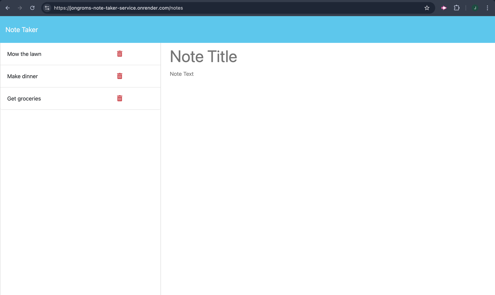

# Note Taker

In this assignment, I built an express powered backend for a note taking web application. I wrote router paths for the pages and for receiving data from a json database of notes.  

## Link to Deployed Version
[Click here to see the deployed version](https://jongroms-note-taker-service.onrender.com/notes)

## Screenshot of the Deployed Version
